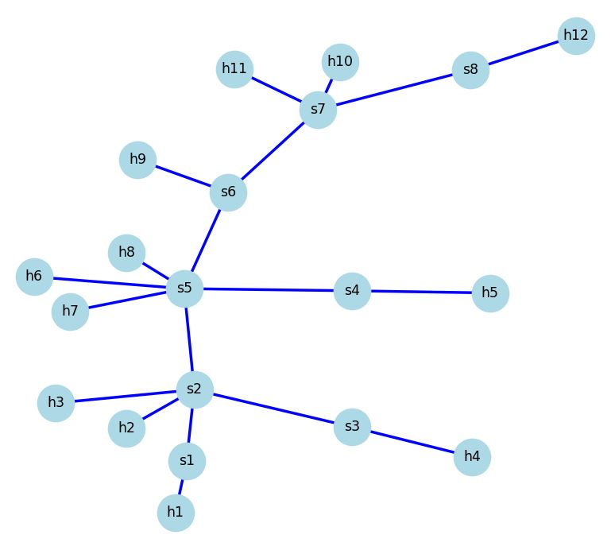

# Computer Networks 2 - Projects

This repository contains two projects for the **Computer Networks 2** course, focusing on **Software-Defined Networking (SDN)** using **Mininet** and **Wireshark**.

## Project 1: SDN and Mininet Questions
- **P1_Questions.pdf**: Questions on SDN and Mininet.
- **P1_Answers.pdf**: Detailed answers to the questions.

## Project 2: SDN Topology and Packet Analysis
- **P2_Questions.pdf**: Questions on SDN topology and packet tracking.
- **P2_Answers.pdf**: Answers to the questions, including Wireshark analysis.
- **P2_Topology.py**: Script to create an SDN topology in Mininet.
- **P2_Schema.py**: Script to generate the network schema.
- **P2_Schema.JPG**: Image of the generated network topology.

